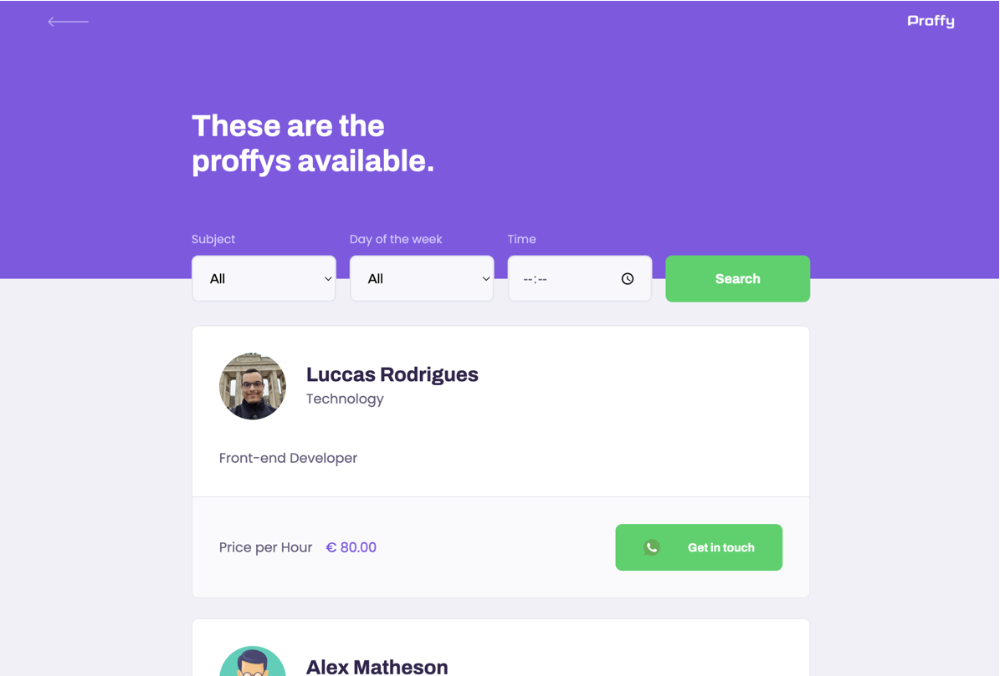

<h1 align="center">
  
    <br> Next Level Week #2 <br> 
    Node.js | ReactJS | PostgreSQL
</h1>

### 🔖 About

---

Proffy is a Web application designed to facilitate the connection between students and teachers. Thus, this application provides teachers with the possibility to register classes, being able to add information such as the subject, cost, and schedule, and gives students the ability to search for registered classes.

This project was conceived with the intention of honoring World Teachers' Day.

This application was made during Next Level Week #2, a [Rocketseat](https://www.rocketseat.com.br/) project.

## 🚀 Technologies

This project was developed using the following technologies:

- [React](https://reactjs.org)
- [TypeScript](https://www.typescriptlang.org/)
- [Node.js](https://nodejs.org/en/)
- [Knex](http://knexjs.org/)
- [SQLite](https://www.sqlite.org/index.html)
- [PostgreSQL](https://www.postgresql.org/)
- [ESLint](https://eslint.org/)
- [Prettier](https://prettier.io/)

## 💻 Project

> <p style="margin-left:5em">🏭  &nbsp;&nbsp;&nbsp;&nbsp;./server - REST API using TypeScript, Express, and PostgreSQL database. </p>
> <p style="margin-left:5em">🔮  &nbsp;&nbsp;&nbsp;&nbsp;./web - Web application in ReactJS and TypeScript. </p>

## 🔖 Layout

To access the layout use [Figma](https://www.figma.com/file/Snen317VmzHluRUHBRlzTE/Proffy-Web-Copy?node-id=0%3A1).

### Screenshots

<div>
   
   
</div>

## 💥 How to use

Clone or download this repository:

```
# Clone the repository
$ git clone https://github.com/luccasro/proffy
```

Navigate to the server folder and install the dependencies:

```
# Navigate to the server folder
$ cd server

# Install the dependencies
$ yarn install

# Run the migration command
$ yarn knex:migrate

# Run
$ yarn start

# running on port 3333

# Production
$ Create a .env file at the root and add the variable DATABASE_URL, specifying the connection string.
```

Navigate to the web folder and install the dependencies:

```
# Navigate to the web folder
$ cd web

# Install the dependencies
$ yarn install

# Run
$ yarn start

# running on port 3000

# Production
$ Create a .env file at the root and add the variable REACT_APP_API_URL, specifying the backend URL.
```

## 📝 License

This project is under the MIT license. See the [LICENSE](LICENSE) file for more details.

---

👩🏻‍💻 **Luccas Rodrigues**

[](https://github.com/luccasro)
[](https://www.linkedin.com/in/luccas-rodrigues/)